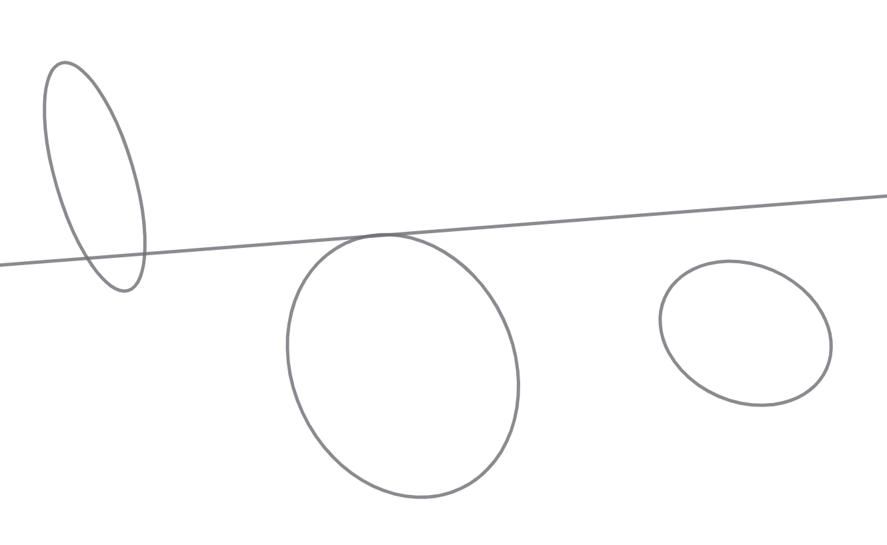
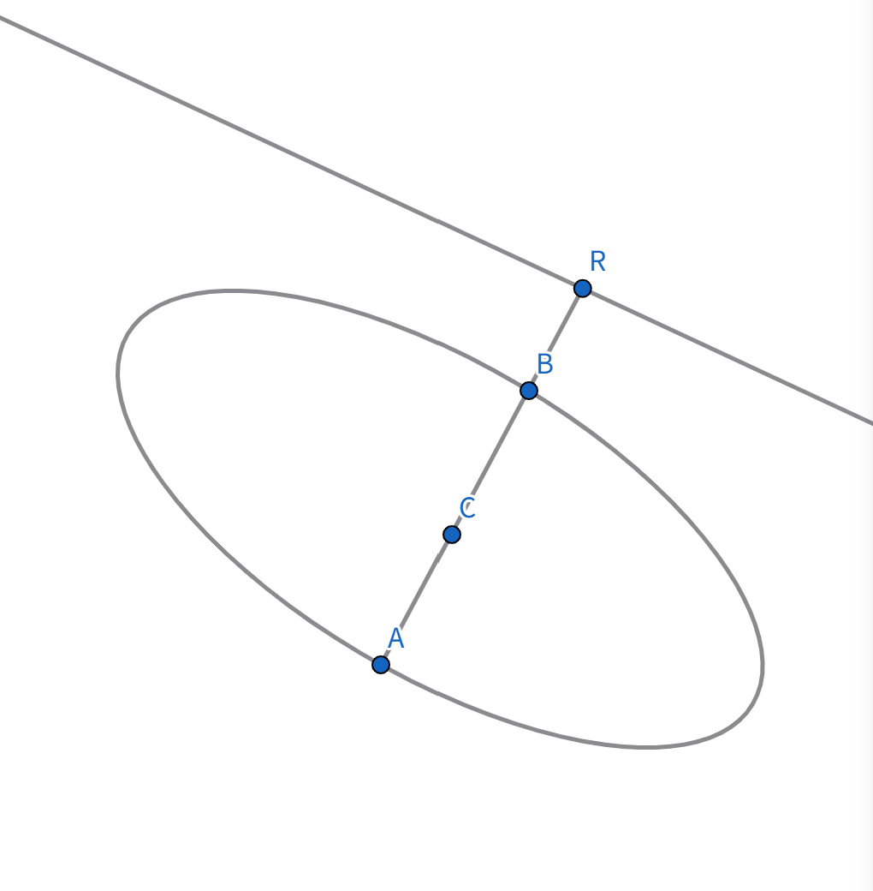
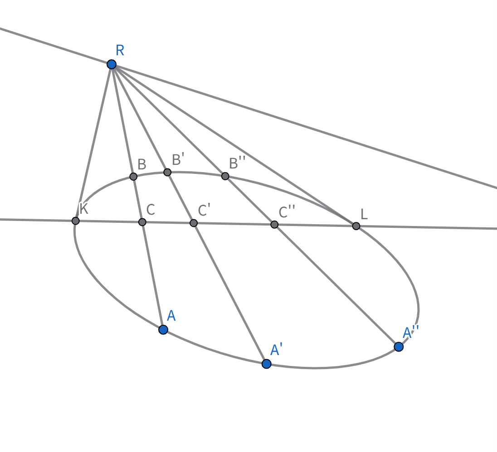
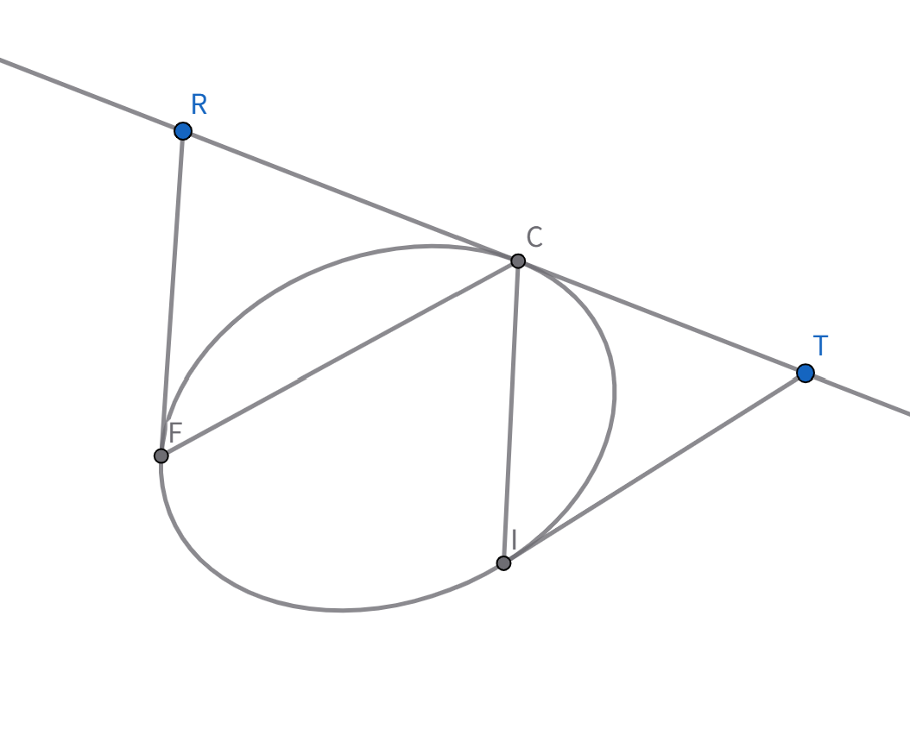
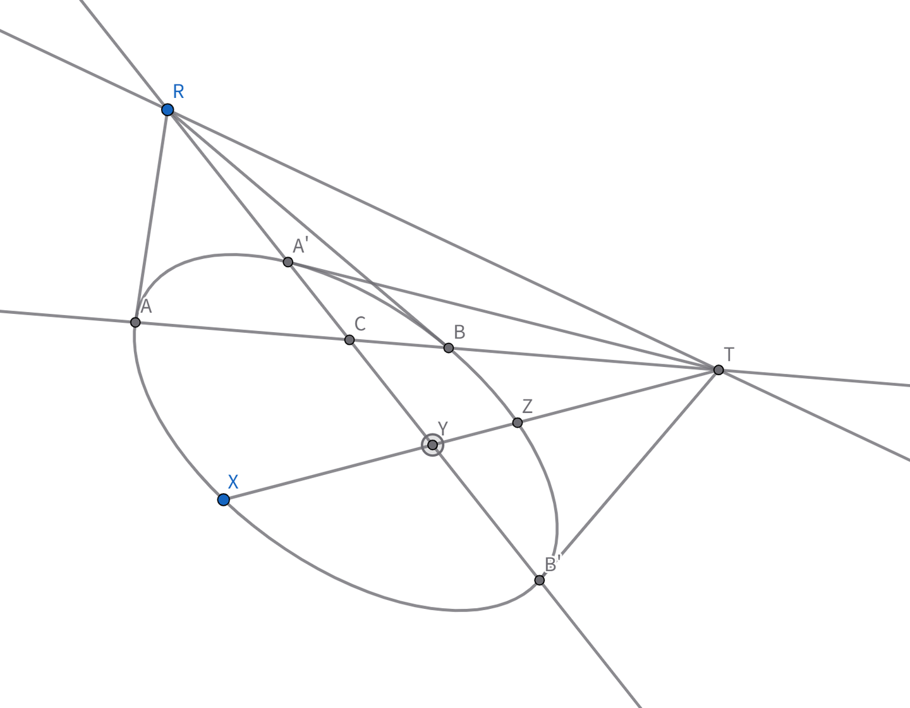
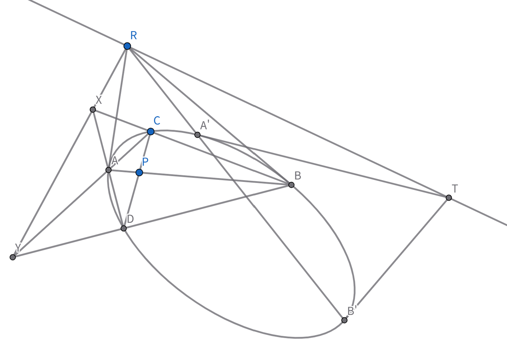
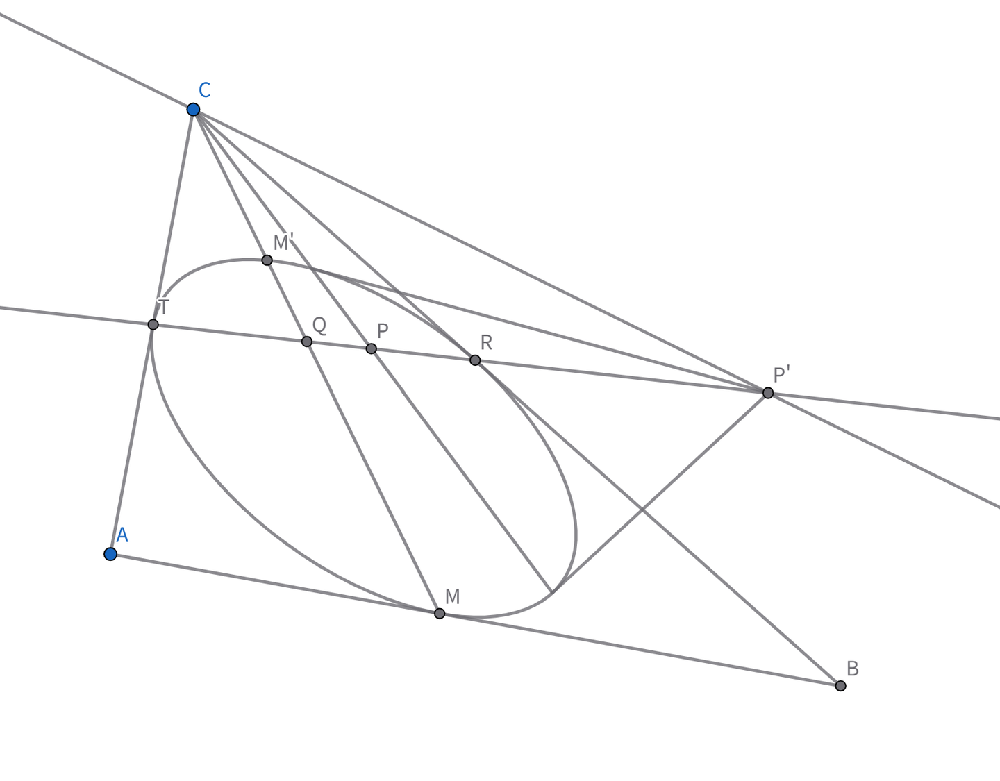

### 引入

在齐次坐标下，仿射变换：

$$ \rho \mathbf{x}' = A\mathbf{x},\quad A=(a_{ij})_{3\times3},\ \det A\neq0 $$

其中仿射变换满足 $a_{31}=a_{32}=0$，

故$$ \rho x_{3}^{\prime}=a_{33}x_3 $$

它使 $x_3=0$ 变成 $x'_3=0$。所以无穷远直线在仿射变换下保持不变，这是本节讨论的基础。

### 二次曲线与无穷远直线的位置关系

我们先依据无穷远直线与二次曲线的位置关系进行**分类**。
$$ S = \sum_{i,j=1}^3 a_{ij} x_i x_j = 0 \xrightarrow{x_3=0} a_{11} x_1^2 + 2a_{12} x_1 x_2 + a_{22} x_2^2 = 0 $$
令 $\Delta = \begin{vmatrix} a_{11} & a_{12} \\\ a_{21} & a_{2} \end{vmatrix}$：
- 当 $\Delta < 0$ 时，有两实根，相交 $\to$ **双曲线型**
- 当 $\Delta > 0$ 时，无实根，相离 $\to$ **椭圆型**
- 当 $\Delta = 0$ 时，有相等实根，相切 $\to$ **抛物型**

可见，非退化二次曲线表示抛物线 $\iff$ 它与无穷远直线相切。

为简化，下记无穷远直线为 $l_\infty$，无穷远点为 $R_\infty$。二次曲线为 $\Gamma$。

### 二次曲线的中心

**定义1**：无穷远直线的极点称为 $\Gamma$ 的**中心**。

设 $l_\infty$ 关于 $\Gamma$ 的极点为 $C(c_1, c_2, c_3)$，线坐标为 $[u_1, u_2, u_3]$ ($u_1=u_2=0, u_3=\lambda \neq 0$)。则：

$$ S_C = (a_{11}c_1+a_{12}c_2+a_{13}c_3)x_1 + (a_{21}c_1+a_{22}c_2+a_{23}c_3)x_2 + (a_{31}c_1+a_{32}c_2+a_{33}c_3)x_3 = 0 $$

两者线坐标成比例，由 Cramer 法则:

 $ c_1:c_2:c_3 = \begin{vmatrix} a_{12} & a_{13} \\\ a_{22} & a_{23} \end{vmatrix} : \begin{vmatrix} a_{13} & a_{11} \\\ a_{23} & a_{21} \end{vmatrix} : \begin{vmatrix} a_{11} & a_{12} \\\ a_{21} & a_{22} \end{vmatrix}$

这也是一般的已知定点求极线的方法。

当 $\Gamma$ 表示双曲线或椭圆时，$\Delta \neq 0$，$c_3 \neq 0$，中心为有穷远点。

$\Gamma$ 表示抛物线时，$\Delta = 0$，$c_3 = 0$，中心为无穷远点。我们称前两者为**有心二次曲线**，后者为**无心**。

由于 $l_\infty$ 在仿射变换下不变，中心在仿射变换下也不变。

过$C$ 作弦 $AB$，与 $l_\infty$ 交于 $R_\infty$。则 $(AB, CR_\infty) = -1 
\therefore (ABC) = -1$。

故 $C$ 平分 $AB$。这表明：$\Gamma$ 的中心平分任意经过中心的弦。

### 直径

**定义2**：**直径**：无穷远点关于 $\Gamma$ 的有穷极线。

由配极原则，直径必过 $\Gamma$ 的中心。

记 $R_\infty$ 关于 $\Gamma$ 的极线为 $p$。过 $R_\infty$ 作割线交 $\Gamma$ 于 $A,B$ 交$p$于 $C$。

则 $(AB, CR_\infty) = -1 \Rightarrow (ABC) = -1 \Rightarrow C$ 平分 $AB$。

由 $R_\infty$ 的任意性，$p$ 即为一组平行弦中点的轨迹。
反之一组平行弦 $AB, A'B'$，$A'' B''$ 的中点均在 $R_\infty$ 的极线 $p$ 上。

抛物线与无穷远直线相切，故无穷远点的极线均过这个切点（配极原则）。

故抛物线直径有公共的无穷远点，即它们互相平行。

### 共轭直径

**定义3**：$\Gamma$ 的一直径与 $l_\infty$ 交点的极线称为该直径的**共轭直径**。
$AB$ 为 $\Gamma$ 一条直径，交 $l_\infty$ 于 $T_\infty$，$T_\infty$ 对应的直径为 $A'B'$。
则由配极原则，$A'B'$ 过 $R_\infty$。

设 $A'B' \cap AB = C$，则 $C$ 同时平分 $AB$、$A'B'$，$C$ 为 $\Gamma$ 中心。

因此，通过中心的两条共轭直线称为共轭直径。

设 $XZ$ 为平行于 $AB$ 的一条弦，交 $A'B'$ 于 $Y$。则 $(XYZ) = -1 \Rightarrow Y$ 为 $XZ$ 中点。
故：与直径平行的一组弦，被它的共轭直径所平分。

从上图还可看出：过一直径的两端点切线平行于该直径的共轭直径（$AR_\infty, BR_\infty, R_\infty B'$）（有心二次曲线才成立）

任取直径 $AB$ 上一点 $P$。过 $P$ 作一条异于 $AB$ 的弦 $CD$。$BC \cap AD = X$，$BD \cap AC = Y$。

则 $XY$ 为 $P$ 点极线，而由 Pascal 定理，$X, Y, R_\infty$ 三点共线。
故 $XY \parallel A'B'$。即：直径上一点 $P$ 的极线平行于 $P$ 的共轭直径。
注：仅限于有心二次曲线成立。

**思考题**：

求证：有心二次曲线上内接平行四边形的两条对角线是这条二次曲线的直径，且平行四边形两条边平行于一对共轭直径。

### 渐近线

**定义4**：二次曲线上的无穷远点的切线（非无穷远直线）称为**渐近线**。

显然，抛物线无渐近线，双曲线有两条实渐近线。椭圆有两条虚渐近线。

$\Gamma$ 上的无穷远点 $T_\infty, R_\infty$，
设两者的切线交于 $C$。则 $T_\infty R_\infty$ 的极点为 $C \Rightarrow C$ 为 $\Gamma$ 中心。
故：渐近线相交中心。

如图，$l, l''$ 是一对共轭直径，它们与 $l_\infty$ 分别交于 $P_\infty$ 和 $P'_\infty$。

记 $CT_{\infty}$ 为 $l_T$，$CR_{\infty}$ 为 $l_R$。

$(l l', l_T l_R) = (P\_{\infty} P^{\prime}\_{\infty}, T\_{\infty} R\_{\infty})$

而 $P\_{\infty}, P^{\prime}\_{\infty}$ 关于 $\Gamma$ 调和共轭。

$T\_{\infty} \in P\_{\infty}P^{\prime}\_{\infty}$

$R\_{\infty} \in P\_{\infty}P^{\prime}\_{\infty}$

则 $(P\_{\infty} P^{\prime}\_{\infty}, T\_{\infty} R\_{\infty}) = -1$。

故：两条渐近线调和分离任何一对共轭直径。

注意：渐近线是无穷远点的极线，因此也是直径，同样具有直径的所有性质。

取 $\Gamma$ 上一点 $M$，作切线，与 $l_T, l_R$ 分别交于 $A,B$。设 $AB \cap l_\infty = K_\infty$。作$K_\infty$的极线$MM'$，它必过点$C$

$\therefore M$ 为直径，其共轭直径为 $CK_\infty$（想一想为什么）

$Tips$ : 配极原则，$Q_\infty$ 的极线既过 $C$ 又过 $K_\infty$。

从而 $l_T, l_R$ 调和分离 $CM, CK_\infty$。$\therefore M$ 为 $(AB, MK_\infty) = -1 \therefore M$ 为 $AB$ 中点。

这表明过双曲线上任一点作切线与两渐近线相交，两交点的连线被该点平分。