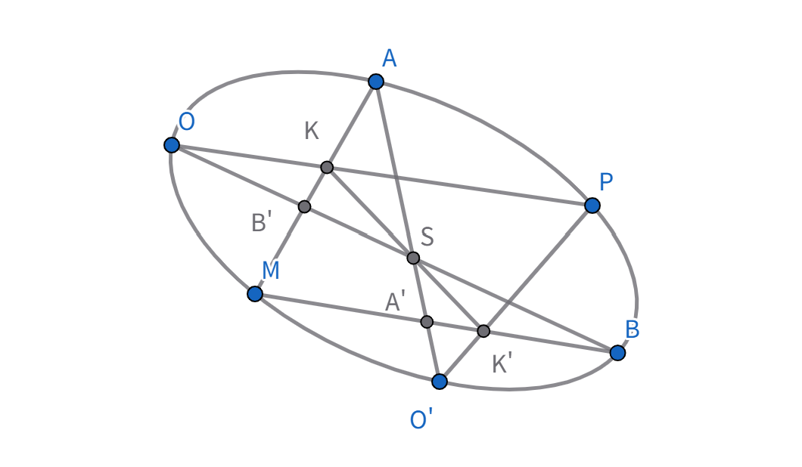
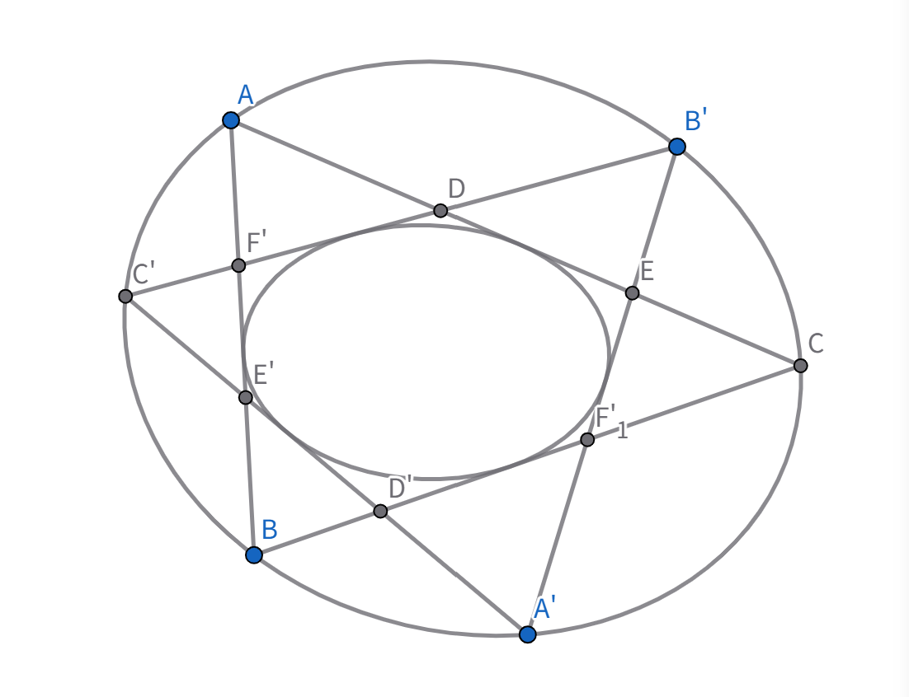

### 二次曲线的射影定义

我们不加证明地给出如下定理：

**两个不同中心的射影对应线束对应直线的交点构成一条二次曲线。**

其逆定理亦成立。特别地，若这两个线束为透视对应，则构成两条直线（退化的二次曲线）（一条是透视轴，一条是中心连线）

注：这两个射影中心亦在此曲线上

接下来我们证明这两个中心不具有特殊性。

设二次曲线 $\Gamma$ 是由以 $O, O'$ 为中心的射影线束 $O, O'$ 生成的。取 $\Gamma$ 上定点 $A, B, P$，$M$ 为 $\Gamma$ 上动点。
依上述定理，$OC(A,B,P,M) \wedge O'(A,B,P,M)$

设 $OB \cap AM = B'$，$AM \cap OP = K$，$BM \cap O'P = K'$，$BM \cap O'A = A'$

$(A, B', K, M) \eqsim O(A, B, P, M) \wedge O'(A, B, P, M) \eqsim (A', B, K', M)$

$\therefore (A, B', K, M) \wedge (A', B, K, M)$

而 $(A, B', K, M) \wedge (A', B, K, M)$ $\therefore$ 对应点连线共点 $S$（定点），

即有 $S \in KK'$

$\therefore A \stackrel{(OP')}{\eqsim} S \stackrel{(OP')}{\eqsim} B$ $\therefore A \wedge B$。$\square$

**推论：从二次曲线上任一点向此曲线上四定点连四直线，则此四直线交比为常数。**

我们再来看一个很优美的定理：

**若两个三角形内接于同一二次曲线，则它们也同时外切于另一条二次曲线。**

**proof**：

如上图。

$(A, F', E', B) \eqsim C'(A, B', A', B) \wedge C(A, B', A', B) \eqsim (E ,B', A', F)$
$\therefore (A, F', E', B) \wedge (E, B', A', F)$

而上述二次曲线的对偶定义告诉我们：

两个成射影对应的点列的对应点的连线与一条二次曲线相切。由此得证。

### 代数表示

在射影平面上，齐次坐标 $(x_1, x_2, x_3)$满足：
$$ \sum_{i,j=1}^3 a_{ij} x_i x_j = 0 \quad (a_{ij} = a_{ji}) $$
$$ = (x_1 \\ x_2 \\ x_3) \begin{pmatrix} a_{11} & a_{12} & a_{13} \\\ a_{21} & a_{22} & a_{23} \\\ a_{31} & a_{32} & a_{33} \end{pmatrix} \begin{pmatrix} x_1 \\ x_2 \\ x_3 \end{pmatrix}^T = 0 $$

的点的集合称为二次曲线。
矩阵 $A_{ij}$ 为对称实矩阵，且至少有一个元素不为0。

下面讨论二次曲线与直线的关系。

$P, Q \in l$。$P(p_1, p_2, p_3)$，$Q(q_1, q_2, q_3)$，则

$\forall M \in l$，$M(x_1, x_2, x_3)$ 且  $x_i = p_i + \lambda q_i \quad (i=1,2,3)$。 

$M$ 的位置由 $\lambda$ 唯一决定，构成一一对应。

联立得：
$$ \sum_{i,j=1}^3 a_{ij} (p_i + \lambda q_i)(p_j + \lambda q_j) = \left( \sum_{i,j=1}^3 a_{ij} q_i q_j \right) \lambda^2 + \left( \sum_{i,j=1}^3 a_{ij} p_i q_j + \sum_{i,j=1}^3 a_{ij} p_j q_i \right) \lambda + \sum_{i,j=1}^3 a_{ij} p_i p_j = 0 $$

若 $Q \notin \Gamma$，则二次项系数不为0。引入如下记号（重复下标自动求和）:

$S = a_{ij} x_i x_j$。
$S_{pp} = a_{ij} p_i p_j$ 
$S_{qq} = a_{ij} q_i q_j$

$S_{pq} = a_{ij} q_j p_i = S_{qp} = a_{ij} q_i p_j$
（此处用了交换 $i,j$ 下标的方法）

$S_p = a_{ij} p_i x_j$。
$S_q = a_{ij} q_i x_j$。

则有 $S_{qq} \lambda^2 + 2S_{pq} \lambda + S_{pp} = 0$。

令 $\Delta = S_{pq}^2 - S_{qq} S_{pp} = \begin{vmatrix} S_{pq} & S_{pp} \\\ S_{qq} & S_{pq} \end{vmatrix}$（为简化，略去因子4）。
 
① 当 $\Delta > 0$ 时，$PQ$ 与 $\Gamma$ 交于两个实点，$PQ$ 为割线。

② $\Delta < 0$ 相离。

③ $\Delta = 0$ 切线。

若 $Q \in \Gamma$，则 $S_{qq} = 0$

当 $PQ$ 为 $\Gamma$ 切线时，$S_{pp} = 0 \Rightarrow S_{pq} = 0$。

此时取 $M \in PQ$，则 $x_i = p_i + \lambda q_i = p_i(1+\lambda) = q_i(1+\lambda)$，则必有 $S_{pm} = 0$。

同理，$P$ 点处切线方程即为 ($P \in \Gamma$)：$S_p = 0$。

若 $P \notin \Gamma$，如何求过 $P$ 的切线？设切线为 $PQ$，则 $\Delta = 0$

即：$S_{pq}^2 = S_{pp} S_{qq}$

而 $Q$ 点任取，可将 $q_i$ 写成 $x_i$，则 $S_{pq} \to S_p$，$S_{qq} \to S$

所以：$S_p^2 = S_{pp} \cdot S$

即为两条切线的并集。当 $P \in \Gamma$ 时，退化为 $S_p = 0$。