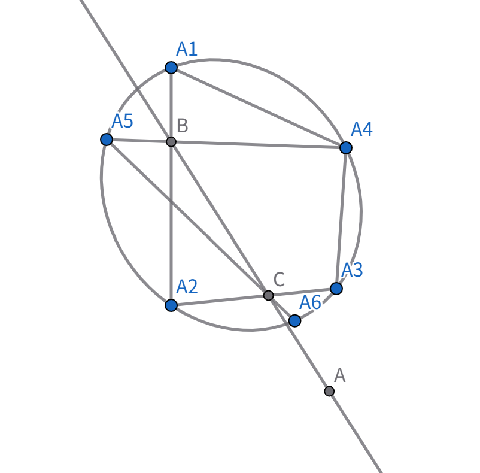
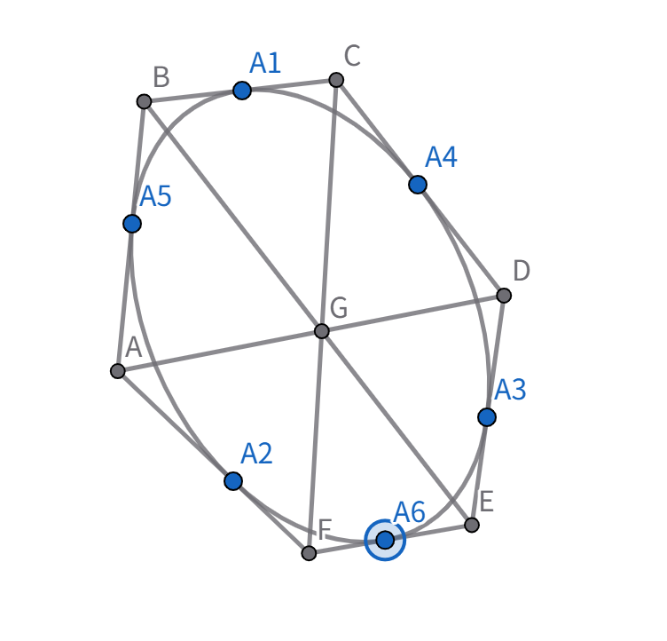
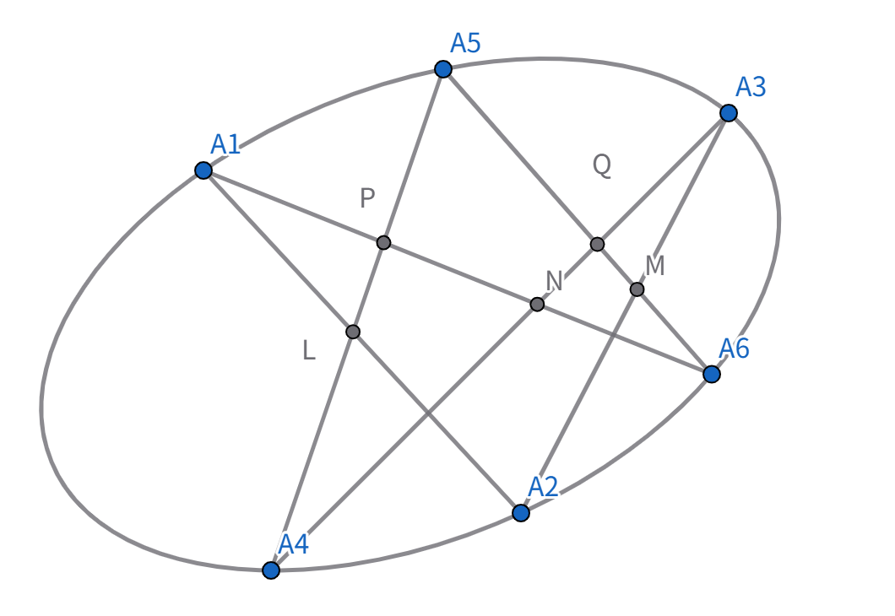
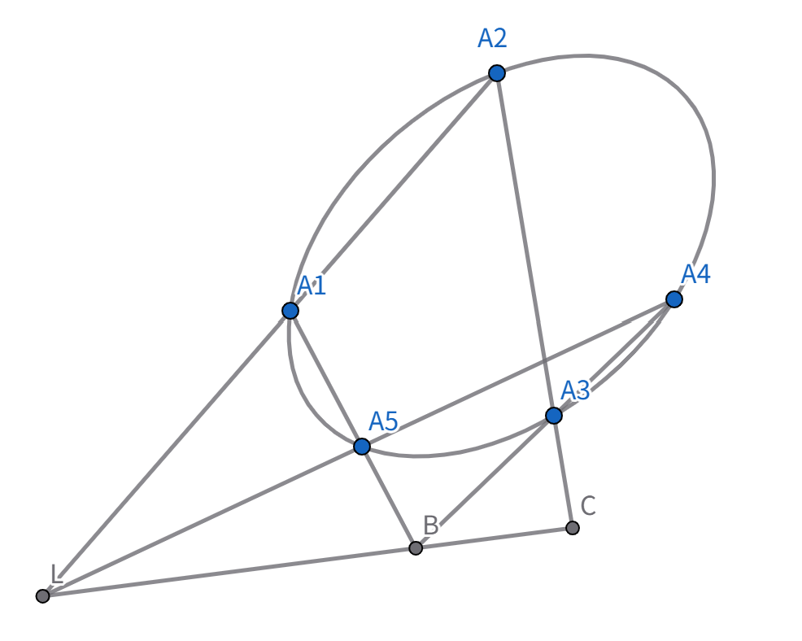
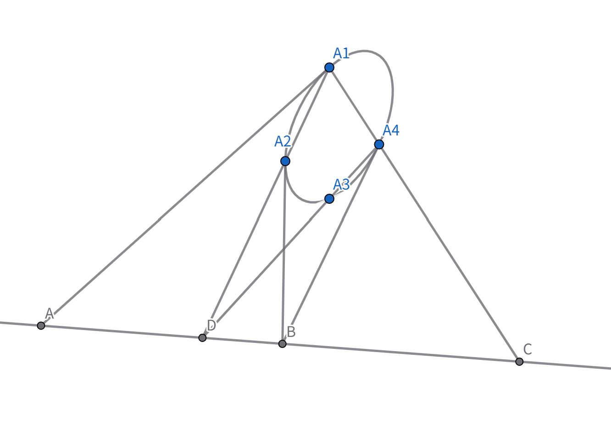
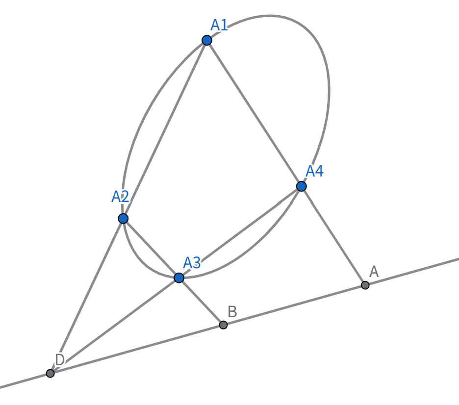
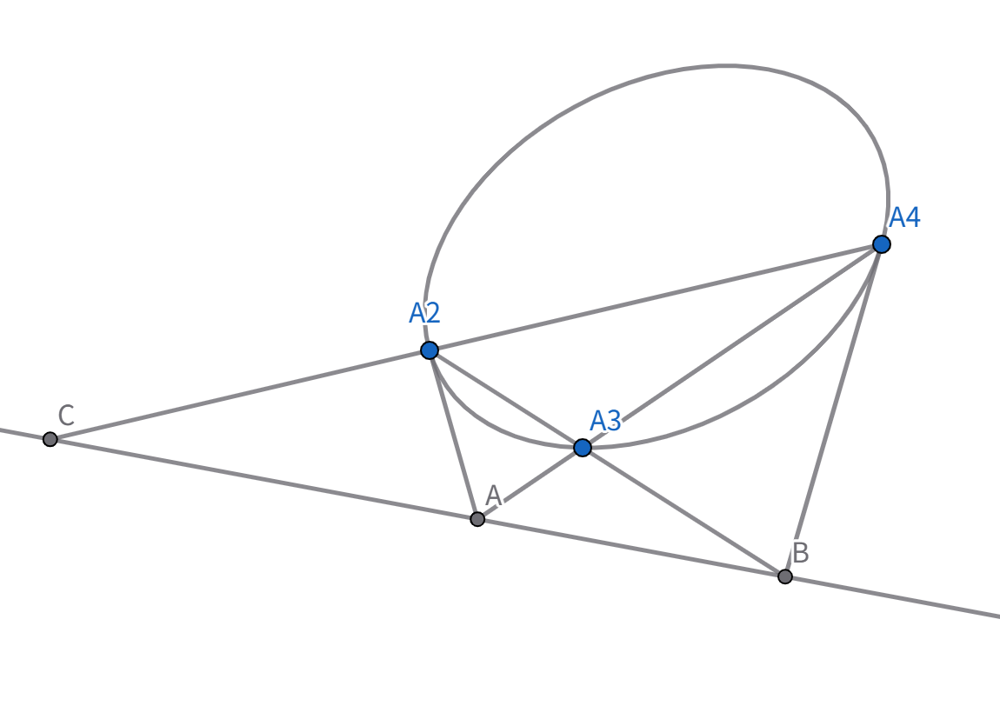
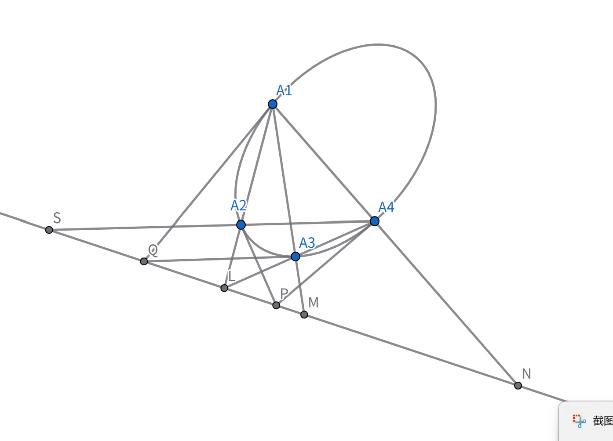
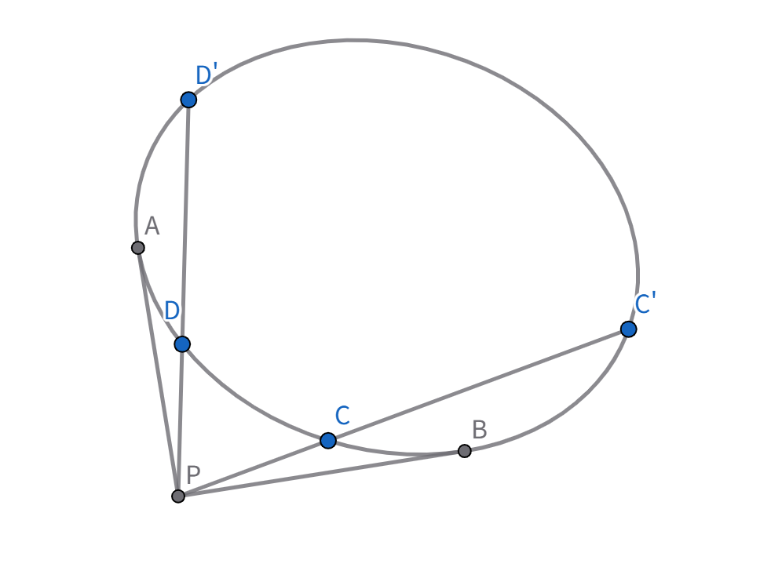

### 帕斯卡与布列安桑定理

**帕斯卡定理：**

**对于任意一个内接于非退化二次曲线的简单六点形，它的三对对边的交点在一直线上。**

$ABC$为**帕斯卡线**

**布列安桑定理：**
对于任意一个外切于非退化二次曲线的简单六线形，它的三对对顶点连线共点。

$S点$为**布列安桑点**

这两个定理相互对偶，我们只需证明 Pascal 定理：

六点形 $A_1A_2A_3A_4A_5A_6$

$L = A_1A_2 \cap A_4A_5$，$M = A_2A_3 \cap A_5A_6$

$N = A_3A_4 \cap A_1A_6$，$P = A_1A_6 \cap A_4A_5$，$Q = A_3A_4 \cap A_5A_6$

则 $(L, A_4, A_5, P) \eqsim A_1(A_2, A_4, A_5, A_6) \wedge A_3(A_2, A_4, A_5, A_6) \eqsim (M, Q, A_5, A_6)$

$\therefore (L, A_4, A_5, P) \eqsim (M, Q, A_5, A_6)$

$\therefore (L, A_4, A_5, P) \wedge (M, Q, A_5, A_6)$

$\therefore LM, A_4Q, A_6P$ 三线共点，而 $N = A_4Q \cap A_6P$ 

故 $L, M, N$ 三点共线。$\square$

每一步均等价，Pascal 定理的逆定理亦成立。

### 帕斯卡定理的退化情形

现在我们来考虑 Pascal 定理的特殊情况：

(1) 五点形 $A_1A_2A_3A_4A_5(A_6)$

(2) 四点形情况 $A_1A_2A_3A_4$

(3) 三点形情况

我们用 Pascal 定理来考察二次曲线上内接四边形的性质。为此，取四点形第一种情况：

由前可知 $(NL, MS) = -1$
若 $P = M$，则 $(NL, PS) = -1$
而 $(N, L, P, S) \eqsim A_2(A_3, A_1, A_2, A_4)$

故 $A_2(A_3, A_1, A_2, A_4) = -1$

可记为 $(A_3A_1, A_2A_4) = -1$

我们称此时的四边形 $A_1A_2A_3A_4$ 为**调和四边形**。它很重要的特征就是两对对顶点处的切线的交点在另两对顶点连线上。在上图中即为：$S = Q$，$M = P$。值得注意的是已知二次曲线上三点可确定一个调和四边形。这和已知点列上三点可确定第四调和点类似。

**小思考**：怎么作图确定？ 

$Tips:$ 作两点切线，连接第三点与两切线交点。

根据这一构型，我们可以用**对合**来生成一个调和四边形。

设构型中各切线和割线的交点为 $P$

从 $P$ 向 $\Gamma$ 引割线 $CC'$，$DD'$ 显然 $(C) \wedge (C')$ 是一个对合，$P$ 称为对合中心。

特别地，若过 $P$ 作 $\Gamma$ 的切线，切点分别为 $A, B$。两个切点称为**对合的不动点**，因为 $f(A) = A$，$f(B) = B$。

此时 $ACBC'$ 或 $ADBD'$ 为**调和四边形**，简记为 $(AB, CC') = -1$。

当然就有 $(BA, CC') = (BA, C'C) = (AB, C'C) = (CC', AB) = \dots = (AB, CC') = -1$

以及 $(AC, BC') = 1 - (-1) = 2$ 等。

当该二次曲线为圆时，假如我们已经知道：圆周角的正弦值与半径成正比，我们便得到：

$\frac{AC \cdot BC'}{BC \cdot AC'} = -1$ 也即 $|AC||BC'| = |BC||AC'|$ 以及 $\frac{AB \cdot CC'}{CB \cdot AC'} = 2$

结合二者可得 $AB \cdot CC' = BC \cdot AC' + AC \cdot BC'$，此即**托勒密定理**。

注：这部分用了欧氏几何的结论，实在不妥，实际上应该使用拉盖尔定理。