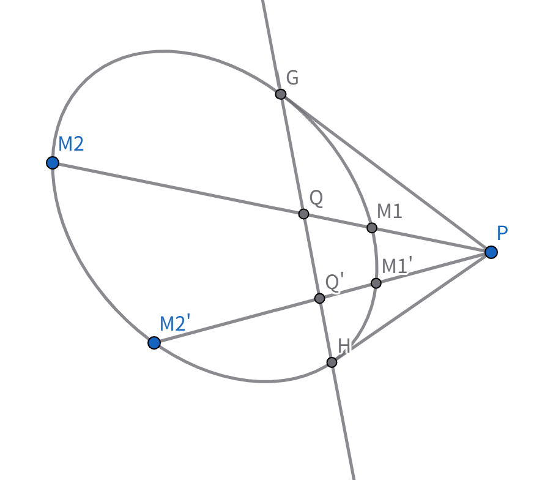

本节讨论对象：非退化二次曲线​ $\Gamma$

**调和共轭**：对给定二次曲线 $\Gamma$，直线 $PQ$ （$P\notin\Gamma ，Q\notin\Gamma$）与 $\Gamma$ 交于 $M_1,M_2$，若交比 $(PQ,M_1M_2)=-1$，则称 $P,Q$ 关于 $\Gamma$ 调和共轭。

设 $P(p_1,p_2,p_3),\ Q(q_1,q_2,q_3)$，$P\notin\Gamma ，Q\notin\Gamma$

$\Gamma: S=0$ ，则 $P,Q$ 关于 $\Gamma$ 调和共轭 $\iff S_{pq}=0$。

**proof**：设交点 $M_{1,2}$ 对应参数 $\lambda_{1,2}$，由 $(PQ,M_1M_2)=\frac{\lambda_1}{\lambda_2}=-1\Rightarrow \lambda_1+\lambda_2=0$。

代入联立方程 $S_{qq}\lambda^2+2S_{pq}\lambda+S_{pp}=0$，由韦达 $\lambda_1+\lambda_2=-\frac{2S_{pq}}{S_{qq}}=0\Rightarrow S_{pq}=0$，反向亦成立。

不难看出，与$P$点关于$\Gamma$调和共轭的点集中的任意元素，满足 $S_{pq}=0$ ，则$S_p=0$即为它们的轨迹方程，是一条直线，记为 $l_P$ ，它称为 $P$ 关于 $\Gamma$ 的极线，$P$ 为极点。

将$S_p=0$代入$S^2_p=S_{pp} \cdot S$得$S=0$

这表明，两切点均在极线上，极线与过 $P$ 的任意割线两端点调和共轭。

注意到，$S_{pq}=S_{qp}$，故有配极原则： $P\in l_Q ，Q\in l_P$。

**推论：**

1.两点连线的极点 = 两点极线的交点；两直线交点的极线 = 两直线极点的连线。

2.共线点的极线共点；共点线的极点共线。

 对$\Gamma$ 上内接四边形 $ABCD$，令 $X=AD\cap BC,\ Z=AB\cap CD,\ Y=AC\cap BD$，可证 $X$ 的极线恰为 $YZ$，同理 $Y$ 极线为 $XZ$、$Z$ 极线为 $XY$，故 $\triangle XYZ$ 为自极三角形（每顶点是另两边所在直线交点的极点）。

小思考：

如何作 $\Gamma$ 上一点 $P$ 的切线？（提示：Pascal 五点形退化情形）
$B,C$ 处切线交点、$A,D$ 处切线交点均在 $YZ$ 上（提示：Pascal 四点形 / 配极原则）。

配极变换本质：射影平面上建立“点↔直线”的一一对应（非奇异对称线性变换 $k u_i=\sum_j a_{ij}p_j,\ \det(a_{ij})\neq0,a_{ij}=a_{ji}$）。核心性质：共线四点的交比 = 其对应极线（共点四直线）的交比，这也是圆锥曲线“定比点差法”的几何背景。