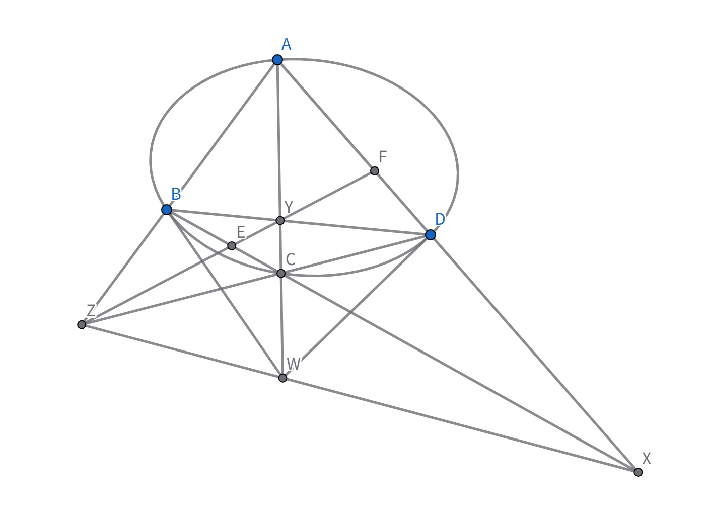

$ Attention$ ：**本节讨论对象为非退化二次曲线​ $\Gamma$**

### 极点与极线

先将点列的调和共轭推广到二次曲线里：

对给定二次曲线 $\Gamma$，直线 $PQ$ （$P\notin\Gamma ，Q\notin\Gamma$）与 $\Gamma$ 交于 $M_1,M_2$，若交比 $(PQ,M_1M_2)=-1$，则称 $P,Q$ 关于 $\Gamma$ **调和共轭**。

设 $P(p_1,p_2,p_3),\ Q(q_1,q_2,q_3)$，$P\notin\Gamma ，Q\notin\Gamma$

$\Gamma: S=0$ ，则 $P,Q$ 关于 $\Gamma$ 调和共轭 $\iff S_{pq}=0$。

**proof**：设交点 $M_{1,2}$ 对应参数 $\lambda_{1,2}$，由 $(PQ,M_1M_2)=\frac{\lambda_1}{\lambda_2}=-1\Rightarrow \lambda_1+\lambda_2=0$。

代入联立方程 $S_{qq}\lambda^2+2S_{pq}\lambda+S_{pp}=0$，由韦达定理 $\lambda_1+\lambda_2=-\frac{2S_{pq}}{S_{qq}}=0\Rightarrow S_{pq}=0$，反向亦成立。

不难看出，与$P$点关于$\Gamma$调和共轭的点集中的任意元素，均满足 $S_{pq}=0$ ，则$S_p=0$即为它们的轨迹方程，是一条直线，记为 $l_P$ ，它称为 $P$ 关于 $\Gamma$ 的极线，$P$ 为极点。

将$S_p=0$代入$S^2_p=S_{pp} \cdot S$得$S=0$

这表明，两切点均在极线上。

注意到，$S_{pq}=S_{qp}$，故有配极原则： $P\in l_Q ，Q\in l_P$。

**推论：**

1.两点连线的极点 = 两点极线的交点；两直线交点的极线 = 两直线极点的连线。

2.共线点的极线共点；共点线的极点共线。

### 自配极三角形

对$\Gamma$ 上内接四边形 $ABCD$，令 $X=AD\cap BC,\ Z=AB\cap CD,\ Y=AC\cap BD$，
 
 
 

$(AD,XF)=-1$。又 $(BC,XE)=-1$。则 $EF$ 为 $X$ 关于 $\Gamma$ 极线（也即$YZ$）

而 $Y\in EF$，故 $XF$ 关于 $\Gamma$ 调和共轭。同理有 $Z,Y$ 关于关于 $\Gamma$ 调和共轭，则 $XZ$ 为 $Y$ 关于 $\Gamma$ 的极线。

称$\triangle XYZ$为**配极三角形**（任一点为另两连线极点）。

这给出了过 $\Gamma$ 外任一点作关于 $\Gamma$ 的极线的方法。

**小思考**：
1. 如何作$\Gamma$上一点$P$的切线？（$Tips:$ 考察 $Pascal$ 定理的五点形情况）。

2. $B,C$ 切线交在 $YZ$ 上，$A,D$ 切线也在 $YZ$ 上。（$Tips:$ $Pascal$ 四点形情形 , 或者配极原则）

### 配极变换

在射影平面上，极点与极线构成点与直线之间一一对应。在此平面上，平面形$F$对应于另一个平面形$F'$

$F,F'$这对图形称为**互相配极的图形**，特别地，$F=F'$则此图形称为**自配极图形**，$F \to F'$称为**配极变换**:

$$
ku_i = a_{i1}t_1 + a_{i2}t_2 + a_{i3}t_3 
$$

其中 $
k \neq 0, \det(a_{ij}) \neq 0, \quad a_{ij} = a_{ji}
$

这是一个非奇异的线性对应，故：

共线四点的交比等于它们对应极线（共点四直线的交比）。

这正是定比点差法中 $\lambda = \frac{x_2-x_0}{x_1-x_0} = \frac{y_2-y_0}{y_1-y_0} = -\frac{l_{M_2}}{l_{M_1}}$ 的背景。