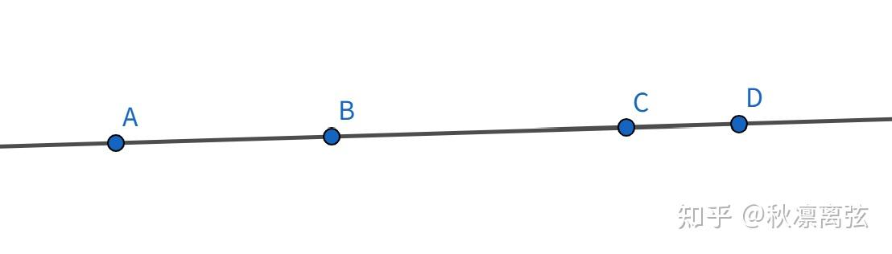
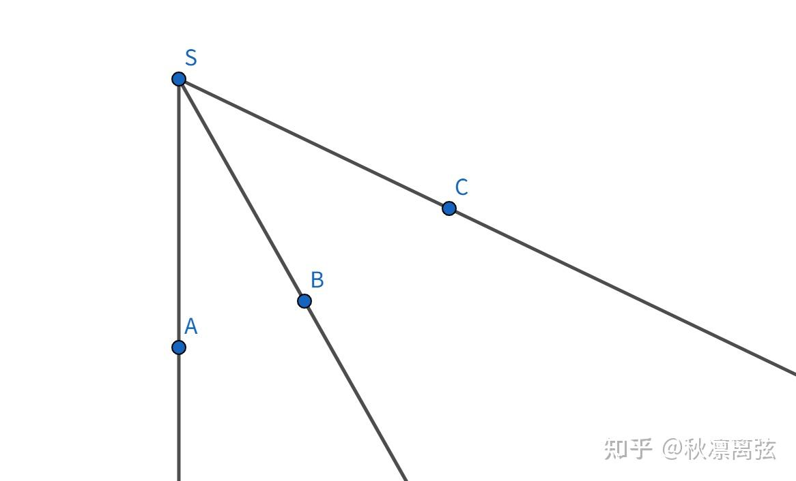
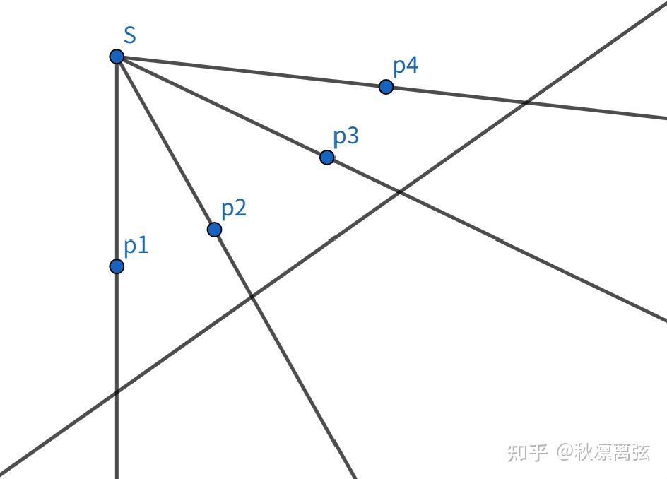
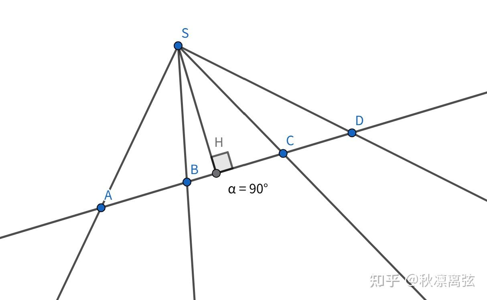
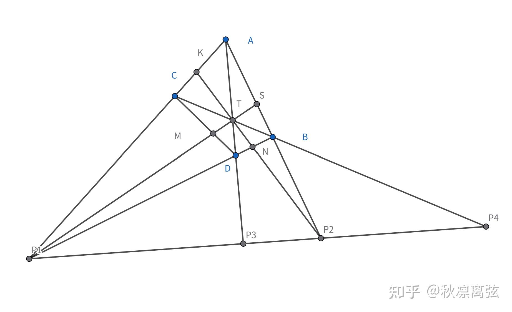
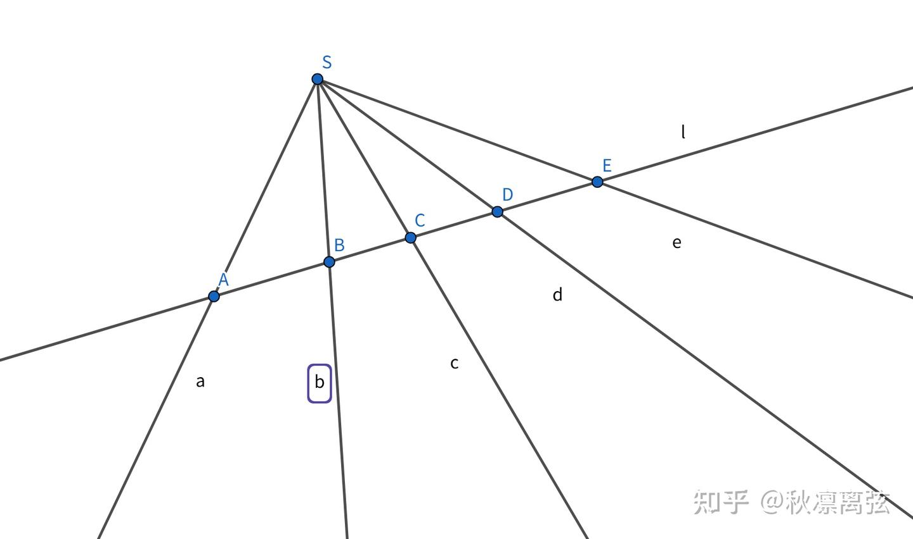
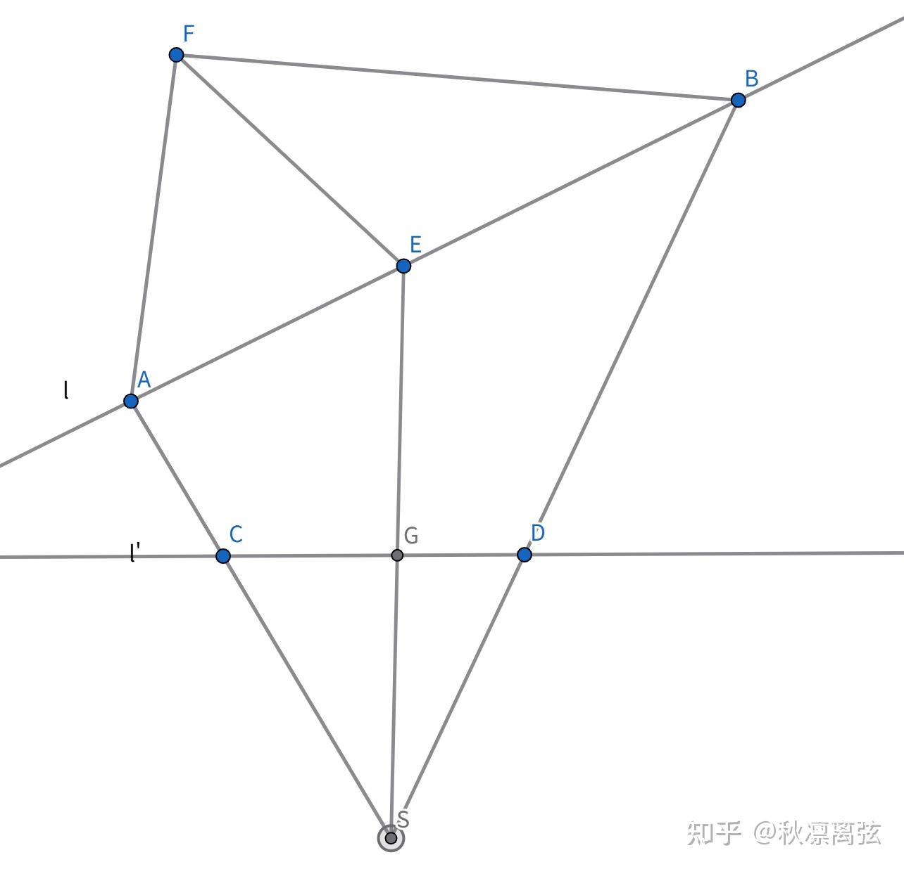
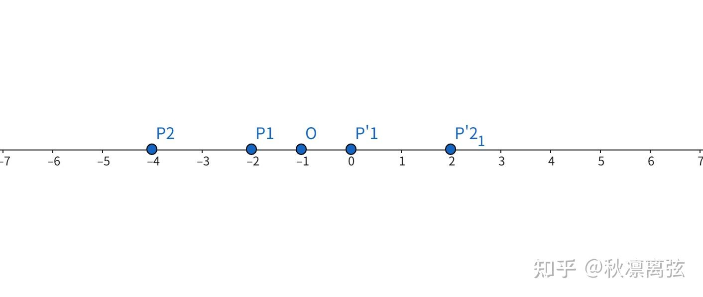
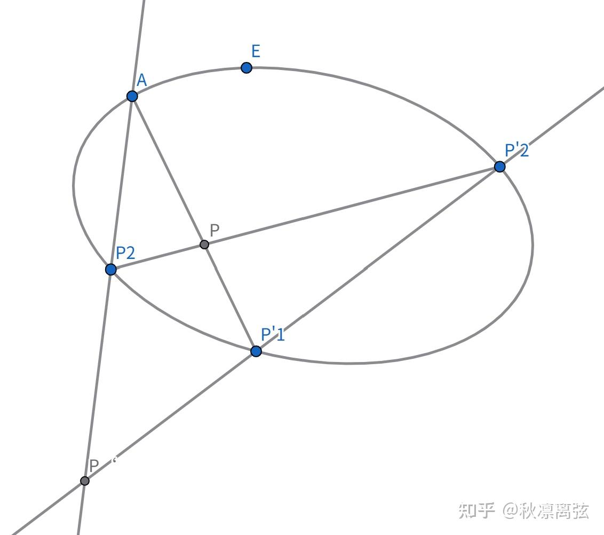

### 单比

共线三点 $A, B, C$ 的单比定义为：

$$
(ABC) = \frac{AB}{BC}
$$

$AB$ 是有向线段。

### 交比的性质与证明

共线四点 $P_1, P_2, P_3, P_4$ 的交比定义为：

$$
(P_1P_2, P_3P_4) = \frac{(P_1P_2P_3)}{(P_1P_2P_4)} = \frac{P_1P_3 \cdot P_2P_4}{P_1P_4 \cdot P_2P_3}
$$

其中 $P_1, P_2$ 称为**基点偶**，$P_3, P_4$ 称为**分点偶**，$P_iP_j$ 为有向线段。

### 交比的符号性质
不难验证，当点偶 $P_1P_2$ 与 $P_3P_4$ **分离**时，交比 $< 0$；当它们**不分离**（共存...

由定义，立刻得出如下性质：

1. $(P_1P_2, P_3P_4) = (P_3P_4, P_1P_2)$
2. $(P_1P_2, P_3P_4) = \frac{1}{(P_2P_1, P_3P_4)}$
3. $1 - (P_1P_2, P_3P_4) = (P_1P_3, P_2P_4) = (P_4P_2, P_3P_1)$

** 性质③的证明：**
$$
(P_1P_3, P_2P_4) = \frac{P_1P_2 \cdot P_3P_4}{P_3P_2 \cdot P_1P_4} = -\frac{(P_1P_3 + P_3P_2)(P_3P_2 + P_2P_4)}{P_1P_4 \cdot P_2P_3} 
$$
$$
= \frac{P_1P_3 \cdot P_3P_2 + P_3P_2 \cdot P_2P_4 + P_3P_2 \cdot P_3P_2}{P_1P_4 \cdot P_2P_3} - \frac{P_1P_3 \cdot P_2P_4}{P_1P_4 \cdot P_2P_3} \\
= 1 - (P_1P_2, P_3P_4) \quad \square
$$
以上三条性质可分别记为：

- 交换基点偶和分点偶，交比不变
- 交换点偶的两个字母，交比取倒数
- 交换中间或两端字母，交比取相反数再+1

据此，我们可将24种交比分为6类。

### 交比的代数表达

一直线上的无穷远点分其上任意两点单比为1

**Proof:** 设 $P_1(x_1, y_1), P_2(x_2, y_2), P(x, y), (P_1P_2P) = \mu$ ，则

$$
x = \frac{x_1 - \lambda x_2}{1 - \lambda}, y = \frac{y_1 - \lambda y_2}{1 - \lambda}
$$

$E$ 点齐次坐标可写为 $(x_1 - \mu x_2, y_1 - \mu y_2, 1 - \mu)$ ，当$\mu = 1$ 时，$P$ 为无穷远点，则

$$
(P_1P_2P_\infty) = 1 \quad \square
$$

调和是交比的特例，定义如下：

### 调和共轭点

**定义：** 若 $(P_1P_2, P_3P_4) = -1$，则称点偶 $P_1P_2$ 调和分离点偶 $P_3P_4$（或调和共轭）。-1

显然有：

$$
(P_1P_2, P_3P_4) = (P_4P_3, P_2P_1) = (P_2P_1, P_4P_3) = -1
$$

若 $P_4$ 为无穷远点，则有：

$$
(P_1P_2, P_3P_4) = \frac{(P_1P_2P_3)}{(P_1P_2P_4)} = (P_1P_2P_3) = -1
$$

$\therefore P_3$ 为 $P_1P_2$ 中点。

按照交比的分类，只要不改变交换两点偶中的点，交比就一定为 $-1$。

### 线束情形

若 $a, b, c$ 为线束 $S$ 中的三直线。

$(abc) = \frac{\sin(a,c)}{\sin(b,c)}$ 称为三直线的单比。$(a,b)$ 为有向角，$a \to b$ 逆时针为正。$a,b$ 叫基线，$c$ 叫分线。

特别地，若 $c$ 为 $(a,b)$ 平分线，则 $(abc) = -1$

与点对类似，有 $(p_1p_2, p_3p_4) = \frac{(p_1p_2p_3)}{(p_1p_2p_4)} = \frac{p_1p_3}{p_1p_4} \frac{p_2p_4}{p_2p_3}$ 此处不再赘述线束交比的性质（包括调和比）。

下面这个定理可谓威力无穷，它是联系点列和线束的桥梁。

**若线束 $S$ 四直线 $a,b,c,d$ 被任何一条直线 $l$ 截于 $A,B,C,D$ 四点，则：**

$$
(AB, CD) = (ab, cd)
$$

**proof:** $2S_{\triangle ABS} = AB \cdot h = |a||b|\sin(a,b) \Rightarrow AB = \frac{|a||b|}{h}\sin(a,b)$。代入交比定义可得证。

由比定理，不难得到：**交比是中心射影不变量。**

读者或许暂时体会不到该定理的威力，在此处我们先用它解决一些比较简单的问题。

例如：已知共线三点 $P_1, P_2, P_3$，如何作出第四调和点和 $P_4$？

我们先看下图：

求证：
$$
(P_1P_2, P_3P_4) = -1
$$

**proof:**

以 $P_2$ 为射心，
$$
(AC, KP_1) = (SM, TP_1) = (BD, NP_1)
$$

以 $T$ 为射心，
$$
(AC, KP_1) = (DB, NP_1) = \frac{1}{(BD, NP_1)}
$$

则
$$
(AC, KP_1)^2 = 1
$$

而 $(AC, KP_1) \neq 1$，则
$$
(AC, KP_1) = -1
$$

以 $T$ 为射心，
$$
(P_3P_4, P_1P_2) = (AC, KP_1) = -1
$$

$\square$

在这个过程中，我们得到了 $(AC, KP_1) = -1$，我们还可以得到：
$$
(DB, NP_1) = (AB, SP_2) = (KN, TP_2) = (CD, MP_2) = -1
$$

其中 $\triangle P_1TP_2$ 叫作完全四点形 $ABDC$ 的对边三点形，我们将在讨论二次曲线的射影理论时再见到它。

**小思考：** 你想到怎么作出第四调和点了吗？

*Tips:* $CB \cap P_1P_2$ 即对角线交点。

### 一维基本形的透视对应

一维基本形指点列和线束，记为 $[\pi]$

若一个点列与一个线束的元素之间建立了一个一一对应，且对应元素是结合的，则将比对应称为透视对应。

如图：

记为
$$
S(a,b,c,d,e) \simeq l(A,B,C,D,E)
$$

但显然，只要 $S \neq l$，那么以 $S$ 为中心的所有直线一定与 $l$ 上的点有一一对应关系（此处默认有结合关系）。因此不妨我们简记为：$S \simeq l$ 或 $l \simeq S$。只不过此时 $S$ 表示以 $S$ 中心的线束，$l$ 表示点列。今后我们都采用这样的符号约定。

若两个线束 $S, S'$ 关于同一个点列 $l$ 透视对应，则称这两个线束为透视线束，$l$ 称为透视轴，可记为：$S \stackrel{(l)}{\simeq} S'$

对偶地有，若两个点列关于同一个线束 $S$ 透视对应，则称 $l, l'$ 为透视点列，$S$ 称为透视中心，可记为 $l \stackrel{(S)}{\simeq} l'$

不难发现，“$\simeq$”传递的是一维基本形的交比。即**交比在透视对应下保持不变**。

应当注意，透视对应不具有传递性即 $S \stackrel{(l)}{\simeq} S'$，$S' \stackrel{(l')}{\simeq} S''$ 则不能推出 $S' \stackrel{(?)}{\simeq} S''$。这说明，两个同类一维基本形之间的透视对应一定要有另一个一维基本形作为“中间媒介”，但这样很不方便。我们当然希望找到一种不需要“中间媒介”的途径。

### 一维基本形的射影对应

**彭赛列（Poncelet）定义**

若 $[\pi] \simeq [\pi_1] \simeq [\pi_2] \cdots \simeq [\pi_n] \simeq [\pi']$，则称 $[\pi]$ 与 $[\pi']$ 之间的对应为射影对应。记为 $[\pi] \wedge [\pi']$

不难看出：
① $[\pi] \wedge [\pi]$。
② 若 $[\pi] \wedge [\pi']$ 则 $[\pi'] \wedge [\pi]$。
③ 若 $[\pi] \wedge [\pi']$，$[\pi'] \wedge [\pi'']$ 则 $[\pi] \wedge [\pi'']$。
④ 若 $[\pi] \wedge [\pi']$ 则 $[\pi] \simeq [\pi']$，反之不成立。

于是，这样的透视链把交比一路传了下来。我们就有：

**施坦纳（Steiner）定义**

若 $[\pi]$ 与 $[\pi']$ 之间的一个一一对应使任意四个元素的交比等于它们对应元素的交比，则此对应为射影对应。

我们不加证明地给出如下定理：
① Steiner定义是等价的定义。

② 两个点列间的射影对应是透视对应的充要条件是它们底的交点自对应。

### 一维射影变换

同一平面内，两个同类的基本形是同底或同中心的，则称为重叠的基本形。而一维射影变换就是两个重叠一维基本形的射影对应。

此处介绍一种特殊的射影变换：对合。

通俗地说，它是一个非恒等变换 $f$ 且有：
$$
\forall A \in \pi, A' \in \pi', f(A) = A', f(A') = A
$$

比如：

1. $P_i, P'_i$ 关于 $O$ 对称，则 $(P_i) \wedge (P'_i)$ 且是一个对合。

2.

$P'_i$ 为 $P_iP$ 与 $\Gamma$ 的另一个交点（$P$ 为定点），则 $(P_i) \wedge (P'_i)$ 且是一个对合。

显然，将元素划分到哪个基本形都是一样的。

还有如下定理：

在一维射影变换中，若有一对对应元素符合对合条件，则此射影变换一定是对合。

**proof:** 以两个重叠点列 $(P)$ 和 $(P')$ 为例。设 $P_i \to P'_i$ 符合对合条件。

任取 $P_i \in P$，对应点为 $P'_i$，设 $P'_i$ 的对应点为 $\overline{P'_i}$，则：
$$
(P_1P'_1, P_iP'_i) = (P'_1P_1, P'_i\overline{P'_i})
$$

由分比性质，上式进而等于 $(P_1P'_1, \overline{P'_i}P'_i)$

由此得 $P_i = \overline{P'_i}$，说明 $P_i$ 也符合对合条件。所以此射影变换为对合。

我们将在讨论调和四边形的生成时再见到对合。

---

最后，我们想再提一下仿射变换和射影变换的关系。单比是仿射不变量，自然就有交比亦是仿射不变量。而单比显然不是射影不变量。因此，我们在处理问题时，若用射影变换，需注意上述问题。